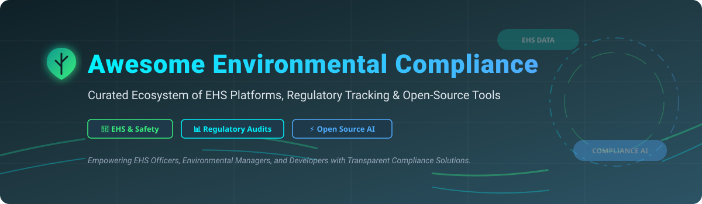

# Awesome Environmental Compliance 🍃 Compliance Management Software & Open-Source Tools 📊

  

  
  
  
  
  
  

> **A curated list of top Environmental, Health, and Safety (EHS) SaaS platforms, environmental compliance software, regulatory tracking tools, and open-source sustainability solutions.** 🌿  
> **Last updated: September 2026** 📅

Welcome to the ultimate resource for **Environmental Compliance Software**, **EHS Management Systems**, **Emissions Tracking Platforms**, and **Open-Source Regulatory Intelligence Tools**. Whether you are an EHS director, environmental manager, sustainability officer, or software engineer building custom compliance workflows, this repository provides data-driven comparisons of enterprise SaaS solutions and self-hostable open-source software.

---

## 📑 Table of Contents
- [🏢 SaaS & Hosted EHS Platforms](#-saas--hosted-ehs-platforms)
  - [📈 Market Analysis & Industry Fragmentation](#-market-analysis--industry-fragmentation)
  - [📊 Top SaaS Environmental Compliance Platforms](#-top-saas-environmental-compliance-platforms)
- [💻 Open-Source GitHub Projects](#-open-source-github-projects)
- [🤝 How to Contribute](#-how-to-contribute)
- [💖 Support & Acknowledgments](#-support--acknowledgments)
- [⚠️ Disclaimer](#%EF%B8%8F-disclaimer)
- [📈 Star History](#-star-history)

---

## 🏢 SaaS & Hosted EHS Platforms

### 📈 Market Analysis & Industry Fragmentation

The global **Environmental, Health, and Safety (EHS) & Sustainability Software market** is estimated at **~$8.5 Billion to $9.2 Billion (2025/2026)** and is projected to reach over **$14 Billion by 2030** (CAGR of ~9.8%). 

The sector is **moderately fragmented**: while large private equity-backed consolidators and corporate safety giants (such as Sphera, Cority, Wolters Kluwer/Enablon, and Ideagen) control significant enterprise market share, no single provider holds a monopoly ("winner-take-all"). The market continues to see specialized niche platforms thrive alongside emerging AI-driven regulatory compliance software.

### 📊 Top SaaS Environmental Compliance Platforms

*The following enterprise SaaS platforms are sorted by company scale (Estimated Annual Revenue / Valuation, descending).* 🏆

| Platform 🏢 | Estimated Scale / Valuation 💰 | Starting Price 🏷️ | Free Tier / Trial Limits ⏳ | Key Capabilities & Regulatory Focus 🎯 |
| :--- | :--- | :--- | :--- | :--- |
| **[Enablon](https://enablon.com/)** | **~$6.5B (€6.1B parent revenue)** *(Wolters Kluwer division)* | Starting from ~$15,000/year (enterprise contract baseline) | No free trial available; interactive live enterprise demo available upon request | Enterprise EHS risk management, carbon emissions accounting, air/water permit tracking, global audit compliance. |
| **[Sphera](https://sphera.com/)** | **~$300M+ Annual Revenue** *(Valued at ~$3 Billion)* | Starting from ~$12,000/year (modular deployment baseline) | No free trial; direct 1-on-1 guided product demo available | Integrated ESG operational risk, Life Cycle Assessment (LCA), hazardous materials tracking, product stewardship. |
| **[Cority](https://www.cority.com/)** | **~$250M - $500M Annual Revenue** *(Thoma Bravo backed)* | Starting from ~$10,000/year (enterprise cloud baseline) | No free trial; tailored platform demonstration available | Complete EHSQ cloud suite, waste stream management, occupational health, industrial hygiene, compliance reporting. |
| **[ProcessMAP](https://www.processmap.com/)** *(Ideagen)* | **~$1.3B (£1.05B parent valuation)** | Starting from ~$8,000/year (facility suite baseline) | No free trial; custom sandbox demonstration for safety teams | Environmental incident reporting, compliance calendar automation, mobile field data collection, CAPA workflows. |
| **[EcoOnline](https://www.ecoonline.com/)** | **~$67.2M Annual Revenue** | Starting from ~$3,600/year (chemical safety module baseline) | 14-day full feature free trial available for Safety & Chemical modules | Chemical safety management, Safety Data Sheet (SDS) management, COSHH risk assessments, incident management. |
| **[Quentic](https://www.quentic.com/)** | **~$38.9M Annual Revenue** *(AMCS Group)* | Starting from ~$5,000/year (core module baseline) | 14-day free trial available for Quentic Mobile App & Audit module | European & international regulatory tracking, legal compliance registers, ISO 14001 / ISO 45001 auditing apps. |
| **[IsoMetrix](https://isometrix.com/)** | **~$32.5M Annual Revenue** | Starting from ~$6,000/year (site license baseline) | No free trial; custom proof-of-concept trial environment upon request | Mining & heavy industry environmental compliance, social license & community tracking, ESG governance frameworks. |
| **[Benchmark Gensuite](https://benchmarkgensuite.com/)** | **~$28.2M Annual Revenue** | Starting from ~$4,800/year (suite starter baseline) | 30-day trial for select digital safety inspection modules | EPA Tier II, TRI, RCRA compliance reporting, permit tracking, air emissions monitoring, AI safety analytics. |
| **[VelocityEHS](https://www.velocityehs.com/)** | **~$25M - $50M Annual Revenue** | Starting from ~$3,000/year (SDS database baseline) | 5-day free trial available specifically for SDS Management solution | Chemical database inventory, SDS authoring & search, GHS container labeling, ergonomics, regulatory updates. |
| **[Enhesa](https://www.enhesa.com/)** | **~$20M - $40M Annual Revenue** | Starting from ~$5,000/year (jurisdiction intelligence license) | No full software free trial; free membership for regulatory articles & webinars | Global EHS regulatory intelligence covering 300+ jurisdictions, multi-site compliance audits, legal change alerts. |

---

## 💻 Open-Source GitHub Projects

These open-source tools provide transparent, self-hostable, and developer-friendly solutions for environmental data analytics, Safety Data Sheet (SDS) management, and regulatory AI compliance monitoring. 🛠️

*Sorted by GitHub Star Count (descending).* ⭐

- **[hashgraph/guardian](https://github.com/hashgraph/guardian)**   
  *Digital Environmental Assets & Carbon Credit Verification Engine.*  
  Open-source platform for creating, managing, and verifying digital environmental assets (carbon credits, renewable energy certificates / RECs). Features a customizable Policy Workflow Engine utilizing Web3 ledger technology for audit-proof, transparent environmental compliance. Built with TypeScript & Node.js (Apache-2.0). 🌿

- **[Carceral-Ecologies/Carceral-ECHO-data](https://github.com/Carceral-Ecologies/Carceral-ECHO-data)**   
  *US Environmental Compliance & Enforcement Data Analysis.*  
  Open data pipeline and research tooling for scraping, analyzing, and assessing EPA enforcement and environmental compliance records (ECHO data) across US facilities and institutional sites. Python & Jupyter Notebooks. 📊

- **[dungnotnull/eia-report-automation-agent-skill](https://github.com/dungnotnull/eia-report-automation-agent-skill)**   
  *EIA Report Automation Engine & Agent Skill.*  
  Production-grade environmental compliance harness for drafting and scoring Environmental Impact Assessment (EIA) reports against IFC, IAIA, and national technical regulatory standards. 🤖

- **[valpere/shopogoda](https://github.com/valpere/shopogoda)**   
  *Environmental Monitoring & Weather Safety Alert Bot.*  
  Production-ready Go application designed for corporate weather monitoring, environmental compliance tracking, and automated safety alert broadcasts for field personnel. 🌤️

- **[nawwarah-analyst/ehs-safety-intelligence](https://github.com/nawwarah-analyst/ehs-safety-intelligence)**   
  *Enterprise EHS Analytics & Operational Safety Intelligence.*  
  Transforms incident, audit, and safety training data into actionable compliance intelligence using BigQuery and Power BI models to prevent workplace hazards. 📈

- **[Pouriazandith1/ARIA-PROJECT](https://github.com/Pouriazandith1/ARIA-PROJECT)**   
  *ARIA Enterprise Environmental & Compliance Agentic System.*  
  Agentic AI system built for automated compliance verification, regulatory documentation extraction, and environmental risk assessment. 🧠

- **[benaiahbrown/ecocomply-ai](https://github.com/benaiahbrown/ecocomply-ai)**   
  *AI RAG Assistant for Environmental Regulatory Gap Analysis.*  
  AI compliance assistant combining RAG (Retrieval-Augmented Generation) with real-time web search over 67 federal and state regulatory documents (~77k chunks) to flag regulatory gaps for landowners. Built with FastAPI, ChromaDB, LangChain, and Supabase. 🤖

- **[didagesierich/green-compliance-ai](https://github.com/didagesierich/green-compliance-ai)**   
  *Rule-based Compliance Risk Scoring & Regulatory Mapping Engine.*  
  Full-stack tool that analyzes business operations, detects hazardous material and emission compliance risks, generates 0-100 risk scores, and maps issues directly to governing regulations. Built with Flask & SQLite. ⚖️

- **[TAStagg/GuardianSDS](https://github.com/TAStagg/GuardianSDS)**   
  *AI-Native SDS Management & Chemical Safety Engine.*  
  Transforms static Safety Data Sheet (SDS) PDFs into structured JSON using AI extraction. Features offline emergency mode, GHS label generation, and automated revision monitoring. Built with Next.js 16, PostgreSQL, and Docker. 🧪

- **[nadlerphd/rEHS](https://github.com/nadlerphd/rEHS)**   
  *R Package for Environmental Health & Safety Analytics.*  
  Statistical tools and analytical routines written in R for EHS professionals performing environmental quantitative risk assessments and workplace hazard data processing. 📉

---

## 🤝 How to Contribute

Contributions are warmly welcomed! Help us keep this environmental compliance resource up to date:

1. 🍴 Fork the repository.
2. 📝 Add or edit entries in `README.md` following the table/list structure.
3. 🔍 Ensure descriptions are objective and link directly to official project homepages.
4. 🚀 Open a Pull Request with a clear summary of changes.

---

## 💖 Support & Acknowledgments

If this repository helped you discover compliance tools or build your environmental systems, please consider supporting the project:

- ⭐ **Star this repository** to increase its visibility for other EHS professionals!
- 🔀 **Fork it** to maintain your own custom list of compliance software.
- 📢 **Share it** with environmental engineers, safety officers, and sustainability leads!
- ☕ **Sponsor the Author**: If you'd like to support open-source compliance lists and tooling, consider buying a coffee via the [GitHub Sponsor Dashboard](https://github.com/sponsors/ishandutta2007). Thank you! ❤️

---

## ⚠️ Disclaimer

- This list is **community-curated** for research and educational purposes — it is not an official endorsement.
- Environmental compliance platforms handle sensitive chemical, regulatory, and worker safety data; always verify compliance requirements against official EPA, OSHA, EU REACH, and local government standards.

---

## 📈 Star History

